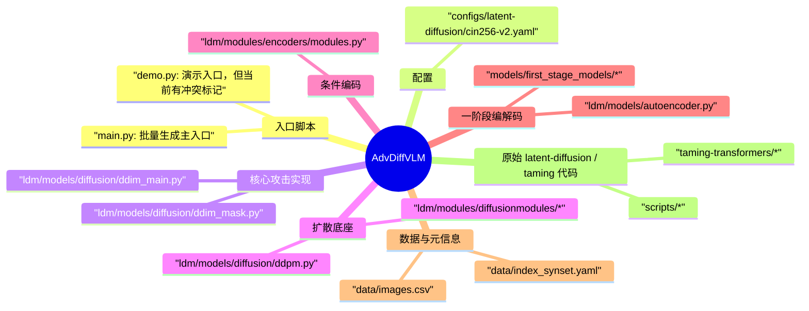
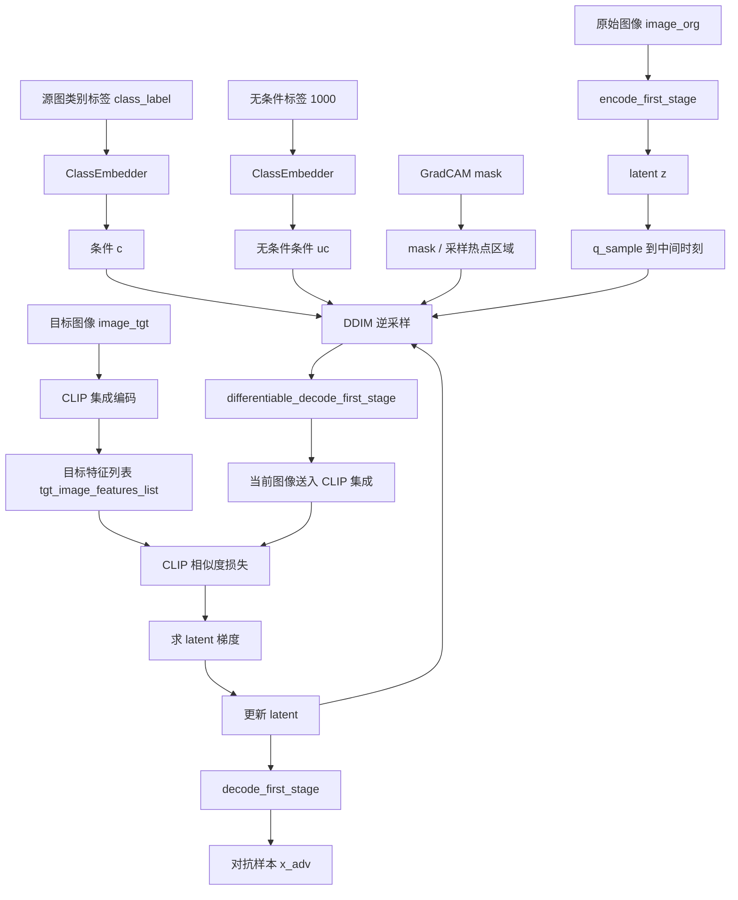

# AdvDiffVLM 代码分析

## 1. 项目定位与核心结论

`AdvDiffVLM` 这份代码的核心目标，是用一个类条件的 latent diffusion model 生成“自然、可迁移、定向”的视觉对抗样本。和传统直接在像素空间做 PGD/MI-FGSM 不同，这里把攻击嵌入到了扩散模型的逆采样过程中：

1. 先把原始图像编码到 latent 空间。
2. 再把 latent 加噪到某个中间时刻。
3. 在 DDIM 逆过程的后半段，用 CLIP 集成模型对“当前生成图像”和“目标图像”之间的语义相似度求梯度。
4. 把这个梯度重新注入 latent，推动生成轨迹朝目标语义偏移。
5. 同时借助 GradCAM mask，把扰动扩散到更合理的空间区域，而不是只集中在一个局部块。

从当前仓库状态来看，这份代码更准确地说是“攻击样本生成代码”，不是完整的实验工程：

- `README.md` 明确说测试代码尚未发布。
- `main.py` 是当前最完整的批量生成入口，但仍保留了很多占位路径和硬编码外部路径。
- `demo.py` 目前存在未解决的 merge conflict，不能直接运行。
- 攻击循环里真正使用的是 CLIP surrogate ensemble，而不是把具体 VLM 放进内环优化。

一句话概括实现思路：

> 这份代码本质上是在 `latent diffusion + classifier-free guidance` 的基础上，额外叠加了 `目标图像语义驱动的 CLIP 梯度更新` 和 `GradCAM 引导的局部空间保真约束`。

## 2. 建议的阅读顺序

如果要快速理解这个仓库，建议按下面顺序读：

1. `configs/latent-diffusion/cin256-v2.yaml`
2. `main.py`
3. `ldm/models/diffusion/ddim_main.py`
4. `ldm/models/diffusion/ddpm.py`
5. `ldm/modules/encoders/modules.py`
6. `demo.py`

原因很简单：

- 配置先告诉你“底座模型到底是什么”。
- `main.py` 告诉你“输入、输出、数据依赖、超参”。
- `ddim_main.py` 告诉你“攻击到底发生在哪一步”。
- `ddpm.py` 负责解释 latent 编码、解码、条件嵌入和 `q_sample` 的含义。
- `modules.py` 负责解释 `class_label -> embedding` 是怎么进入扩散模型的。

## 3. 目录结构总览



## 4. 底座模型是什么

这份代码不是从零训练一个扩散模型，而是建立在 CompVis 的 latent diffusion 实现上。`configs/latent-diffusion/cin256-v2.yaml` 给出的关键信息如下：

- 模型类型：`ldm.models.diffusion.ddpm.LatentDiffusion`
- 条件类型：`cond_stage_key: class_label`
- 条件注入方式：`conditioning_key: crossattn`
- latent 分辨率：`image_size: 64`
- latent 通道：`channels: 3`
- 一阶段模型：`VQModelInterface`
- 条件编码器：`ClassEmbedder`
- 条件类别数：`n_classes: 1001`

这意味着当前实现不是文本条件扩散，而是 **ImageNet 类标签条件扩散**。也就是说，扩散模型的“生成先验”来自类别语义，定向攻击的“偏移方向”来自目标图像的 CLIP 特征。

### 4.1 条件嵌入是怎么做的

`ldm/modules/encoders/modules.py` 中的 `ClassEmbedder` 非常直接：

- 输入：`batch["class_label"]`
- 处理：通过一个 `nn.Embedding(n_classes, embed_dim)`
- 输出：形状为 `[B, 1, 512]` 的类嵌入

因此，这里的扩散先验是“给定源图真实类别标签，沿该类别的生成流形进行编辑”，而不是完全无约束生成。

### 4.2 图像为什么先变成 latent

`ddpm.py` 里有三组关键接口：

- `encode_first_stage(x)`：把图像编码到 VQ latent
- `get_first_stage_encoding(...)`：得到最终 latent `z`
- `decode_first_stage(z)` / `differentiable_decode_first_stage(z)`：把 latent 解码回图像

这意味着攻击不是直接在 `256 x 256` 像素空间做，而是在 `3 x 64 x 64` 的 latent 上做。这样做的直接收益是：

- 优化空间更平滑
- 更容易保持自然图像先验
- 生成结果更像“被语义编辑过的真实图像”，而不是单纯加了噪声

## 5. 端到端流程总览



这个图里最关键的不是“扩散模型在生成图像”，而是：

- 扩散模型负责提供自然图像流形
- CLIP 集成负责提供目标语义方向
- GradCAM mask 负责控制扰动空间分布

## 6. `main.py` 做了什么

`main.py` 是当前最接近“正式攻击主程序”的入口。按执行顺序拆开看，大致如下。

### 6.1 初始化

1. 载入 `cin256-v2` 的类条件 latent diffusion 权重。
2. 载入 4 个 CLIP surrogate：
   - `RN50`
   - `RN101`
   - `ViT-B/16`
   - `ViT-B/32`
3. 构造用于 CLIP 的输入预处理。
4. 构造用于保存结果的简单后处理。

这里需要注意一件事：虽然还加载了 `ViT-L/14`，但并没有放进 `models` 列表，真正参与攻击集成的只有 4 个模型。

### 6.2 数据准备

`main.py` 依赖 4 类外部输入：

1. 干净原图目录 `cle_data_path`
2. 目标图像目录 `tgt_data_path`
3. GradCAM mask 目录 `cam_root`
4. `images.csv` 中的标签元数据

这里的“目标图像”不是文本 prompt，而是已经准备好的目标图片。也就是说，这套攻击不是“朝目标文本语义攻击”，而是“朝目标图像语义攻击”。

### 6.3 每张图像的主流程

对每个 `(image_org, image_tgt)`，`main.py` 做了这些事：

1. 把目标图像送入 4 个 CLIP，得到 `tgt_image_features_list`
2. 从当前文件名映射回 `ImageId`
3. 再从 `images.csv` 里查到源图对应的 `TrueLabel`
4. 用这个类别生成条件嵌入 `c`
5. 用类别 `1000` 生成无条件嵌入 `uc`
6. 把源图编码成 latent `z`
7. 读入对应的 GradCAM mask
8. 调用 `sampler.sample(...)`
9. 重复调用 10 次采样，以前一次输出 latent 作为下一次输入
10. 最后解码并保存生成结果

这里有一个非常重要的观察：

> 代码里的“多轮攻击”不是通过 `K>1` 在采样器内部完成的，而是通过 `main.py` 外层把上一次输出 `samples_ddim` 再次作为 `x_T` 传回采样器完成的。

这一点会影响你对超参的理解，后面会展开说。

## 7. 攻击真正发生在哪里

真正的攻击逻辑不在 `main.py`，而在 `ldm/models/diffusion/ddim_main.py`。

很多人第一眼会以为 `sampler.sample(...)` 只是普通 DDIM 采样。实际上不是。这个 sampler 是“标准 DDIM + 额外对抗梯度更新”的混合版本。

整体可以拆成 4 层：

1. 采样调度层：`sample`
2. 逆扩散主循环层：`ddim_sampling`
3. 单步 DDIM 更新层：`p_sample_ddim`
4. 对抗目标层：CLIP 集成相似度梯度

## 8. 攻击流程细拆

这一节是核心。

### 8.1 第一步：从原图 latent 出发，而不是纯随机噪声

在 `ddim_sampling` 里，如果传入了 `x_T`，代码不会从高斯噪声开始，而是：

1. 把 `x_T` 记作 `z`
2. 选择一个固定的加噪时刻 `t = 201`
3. 调用 `self.model.q_sample(z, t, noise=...)`
4. 得到一个处在中间时刻的 noisy latent `img`

这意味着当前实现更像是：

- 对源图 latent 做“有限深度的扩散-逆扩散编辑”
- 而不是从纯噪声完全重采样一张图

这种做法的好处是保真度更高，因为初始点仍然围绕原图 latent。

### 8.2 第二步：只攻击逆过程的后 20%

代码里有一行非常关键：

```python
if(index > total_steps * 0.2):
    continue
```

假设 `ddim_steps = 200`，这意味着只有最后 40 个反向步真的参与攻击更新，前面的步数被跳过。

可以把它理解成：

- 前 80% 的逆扩散几乎不碰
- 后 20% 才注入对抗梯度

这是一种典型的折中：

- 太早介入，图像结构会崩
- 太晚介入，语义偏移不够

### 8.3 第三步：GradCAM-guided mask 如何工作

代码不是直接把整张图都放开优化，而是对当前时刻构造了一个 mask。

流程如下：

1. 读入 `cam`
2. 把 `cam` clamp 到 `[0.3, 0.7]`
3. 把它归一化成概率图 `prob_matrix`
4. 从这个概率图里随机采样一个坐标 `(x, y)`
5. 以 `(x, y)` 为中心，挖掉一个 `8 x 8` 左右的小块
6. 得到最终 `mask`

然后代码执行：

```python
img_orig = self.model.q_sample(x0, ts)
img = img_orig * mask + (1. - mask) * img
```

这一步的意义是：

- `mask == 1` 的区域，尽量贴近源图在当前噪声时刻的 latent
- `mask == 0` 的区域，允许当前攻击 latent 自由变化

所以这里的 mask 不是“只攻击高响应区域”，而更像是：

> 每一步从 GradCAM 热点区域随机挑一个局部窗口放开编辑，其余区域尽量保持源图结构。

这和论文里“把对抗语义分散到图中而非集中到一个区域”的说法是能对上的。

### 8.4 第四步：先做标准 DDIM 单步，再做对抗修正

标准 DDIM 更新在 `p_sample_ddim` 中完成，核心公式就是：

1. 先预测噪声 `e_t`
2. 再恢复当前步对应的 `pred_x0`
3. 最后得到 `x_{t-1}`

代码形式是：

```python
pred_x0 = (x - sqrt_one_minus_at * e_t) / a_t.sqrt()
dir_xt = (1. - a_prev - sigma_t**2).sqrt() * e_t
x_prev = a_prev.sqrt() * pred_x0 + dir_xt + noise
```

另外它还用了 classifier-free guidance：

```python
e_t = e_t_uncond + scale * (e_t - e_t_uncond)
```

这里的 `scale = 5.0`。

很重要的一点是：

> 当前实现并不是直接修改 `score` 或 `epsilon`，而是在标准 DDIM 更新完成之后，再对 `img` 做一次显式梯度步。

这和 README 中“modify the score during reverse generation process”的描述是相关但不完全等价的。更准确地说，代码实现的是“在 reverse process 内部插入 latent gradient ascent”。

### 8.5 第五步：CLIP 集成目标如何构造

在每个攻击时间步，代码会：

1. 对当前 latent `img_n` 做 `differentiable_decode_first_stage`
2. 把解码结果从 `[-1, 1]` 映射到 `[0, 1]`
3. 做 CLIP 预处理
4. 送进 4 个 CLIP 模型
5. 分别得到当前图像在 4 个模型上的特征
6. 与目标图像特征做余弦相似度

损失项是：

```python
crit1 = mean(sum(pred_i * target_i, dim=1))
```

因为特征已经归一化，这基本就是 cosine similarity。

这里的优化方向不是“降低相似度”，而是 **增大与目标图像的相似度**。所以这是一个明确的 targeted attack。

### 8.6 第六步：AEGE 自适应集成权重是怎么做的

代码里维护了两个张量：

- `costs`
- `weights`

前两步直接把所有模型权重设为 `1`。从第三步起，按下面的方式更新：

1. 看每个模型最近两步的 `cost` 比值
2. 得到 `w1, w2, w3, w4`
3. 经由温度 `Temp = 2` 做指数变换
4. 形成下一步的模型权重

它试图表达的是：

- 如果某个 surrogate 的相似度提升更快
- 那么后续更相信这个 surrogate 提供的梯度

这是 AEGE 的代码化体现。

但要注意，当前实现并不是标准 softmax 归一化。代码是：

```python
weights[i, m] = sum_w / N_models * exp(w_m / Temp)
```

这会导致权重总和不等于 1，因此更像“按变化趋势放缩每个模型贡献”，而不是标准意义上的概率归一化集成。

### 8.7 第七步：真正的对抗更新发生在 latent 上

拿到总损失后，代码执行：

```python
gradient = torch.autograd.grad(loss, img_n)[0]
gradient = torch.clamp(gradient, min=-0.0025, max=0.0025)
img = img + s * gradient
```

这里的关键点有 4 个：

1. 梯度变量是 `img_n`，也就是当前时刻的 latent
2. 梯度先被裁剪到 `[-0.0025, 0.0025]`
3. 再乘以一个很大的系数 `s`
4. 最终做的是显式加法更新，而不是 sign update

所以它更接近：

> 在 reverse diffusion 的每个后期时间步里，做一次小范围、连续值的 latent gradient ascent。

这里没有直接使用 `gradient.sign()`，说明作者更偏向平滑、可控的语义偏移，而不是离散、强硬的扰动冲击。

### 8.8 第八步：外层 10 次重复是什么意思

`main.py` 在第一次 `sampler.sample(...)` 之后，又执行了 9 次：

```python
samples_ddim, _ = sampler.sample(..., x_T=samples_ddim, ...)
```

这相当于：

- 把上一次攻击后的 latent 重新视为“新的起点”
- 再加噪到 `t=201`
- 再走一遍攻击式 reverse diffusion

因此整体不是一次 200 步的攻击，而是：

> 10 轮“重新加噪 + 局部逆扩散攻击”的迭代编辑。

这一步对最终强度影响很大，也解释了为什么作者把 `K` 设成了 `1`。

## 9. 攻击流程伪代码

下面这段伪代码基本对应当前 `main.py + ddim_main.py` 的逻辑。

```python
for each (x_org, x_tgt, cam):
    f_tgt = [CLIP_m(preprocess(x_tgt)) for m in ensemble]
    y = true_label_from_images_csv(x_org)
    c = ClassEmbedder(y)
    uc = ClassEmbedder(1000)
    z = Enc(x_org)

    z_adv = z
    repeat 10 times:
        x_t = q_sample(z_adv, t=201, noise=eps)
        for t in reverse(last_20_percent_steps):
            M = build_mask_from_gradcam(cam)
            x_t = q_sample(z_adv, t) * M + (1 - M) * x_t
            x_t = DDIM_step(x_t, c, uc, guidance_scale=5.0)

            x_img = preprocess(Dec_diff(x_t))
            f_adv = [CLIP_m(x_img) for m in ensemble]
            w = adaptive_weights(cost_history)
            loss = sum(w_m * cos(f_adv[m], f_tgt[m]) for m in ensemble)

            g = clamp(grad(loss, x_t), -0.0025, 0.0025)
            x_t = x_t + s * g

        z_adv = x_t

    x_adv = Dec(z_adv)
```

## 10. `ddim_main.py` 和 `ddim_mask.py` 的区别

这两个文件非常相似，本质都是“带攻击逻辑的 DDIM sampler”，区别主要体现在参数和攻击窗口上。

### 10.1 `ddim_main.py`

- 中间加噪时刻：`t = 201`
- 攻击窗口：最后 `20%`
- mask 下限：`clamp(mask, 0.045, 1)`
- 自适应权重起始下标：`idx_time = 159`

### 10.2 `ddim_mask.py`

- 中间加噪时刻：`t = 251`
- 攻击窗口：最后 `25%`
- mask 下限：`clamp(mask, 0.0, 1)`
- 自适应权重起始下标：`idx_time = 149`

这说明 `ddim_mask.py` 比 `ddim_main.py`：

- 从更“早”的噪声状态开始编辑
- 在更多时间步里施加攻击
- 空间约束相对更宽松

也就是说，`ddim_mask.py` 理论上更激进，图像语义偏移更强，但保真度风险也更高。

## 11. 关键实现点的真正含义

这一节专门回答“论文名词在代码里落在哪里”。

### 11.1 AEGE 在代码里对应什么

从代码看，AEGE 对应的是：

- 多个 CLIP surrogate 同时参与损失计算
- 每个 surrogate 的贡献不是固定相加
- 而是根据最近两步的相似度变化自适应调整

所以 AEGE 的本质是：

> 自适应的 surrogate ensemble weighting。

### 11.2 GCMG 在代码里对应什么

从代码看，GCMG 不是在仓库内部重新计算 GradCAM，而是假设外部已经生成好了 mask 图。

然后当前仓库内部做的是：

1. 读取 mask
2. 对高响应区域做随机采样
3. 每一步只放开一个局部块进行自由编辑
4. 其余区域通过 `img_orig * mask` 尽量保持原图结构

因此，GCMG 在当前仓库中的落地形式更像：

> 外部生成 GradCAM，内部将其变成“时序上的局部编辑门控”。

### 11.3 为什么目标是图像而不是文本

当前攻击优化目标完全来自：

- `image_tgt -> CLIP features`

而不是：

- `prompt -> text encoder -> loss`

所以这是一个 **图像目标驱动** 的 targeted attack。目标语义来自具体目标图像，而不是自然语言。

## 12. 当前代码状态与工程风险

这一节非常重要，因为很多“看不懂”的地方其实是工程残留，不是算法本身复杂。

### 12.1 `demo.py` 当前不可直接运行

`demo.py` 里有明显的 merge conflict 标记：

- `<<<<<<< HEAD`
- `=======`
- `>>>>>>> ...`

所以它当前不是合法 Python 文件。结合文件名和冲突内容推断，作者原本应该是在维护一个带 mask 的演示版本，但当前仓库没有把它整理干净。

### 12.2 `main.py` 也不是开箱即用

`main.py` 里仍然有多处占位符或环境耦合：

- `cle_data_path = ''`
- `tgt_data_path = ''`
- `cam_root = ''`
- `pd.read_csv('')`
- checkpoint 使用硬编码绝对路径

这说明它更像作者本地实验脚本，而不是整理好的通用入口。

### 12.3 一些参数已经“名存实亡”

当前实现里有几个变量没有真正发挥作用：

- `a`：传入 sampler，但没有被使用
- `label`：传入 sampler，但采样器内部没有用
- `org_image_features_list`：接口保留，但没有参与损失
- `classes = [2]`：在 `main.py` 中没有实际参与控制逻辑

### 12.4 `K` 看起来支持多次内部循环，但当前写法并不真正累积

采样器里有：

```python
pri_img = img.detach().requires_grad_(True)
for k in range(K):
    img = pri_img.detach().requires_grad_(True)
```

这意味着如果 `K > 1`，每次都会从同一个 `pri_img` 重新开始，而不是从上一轮结果继续。因此当前写法下，`K` 并不是一个真正意义上的“内部迭代次数累积器”。

也正因如此，作者在 `main.py` 里实际用的是：

- `K = 1`
- 外层重复调用 sampler 10 次

### 12.5 `costs/weights` 预留了 5 列，但只用了 4 个 surrogate

`costs = torch.zeros([72, 5])`

但真正参与优化的 CLIP 模型只有 4 个，因此第 5 列始终空置。这个现象说明代码可能曾经尝试过 5 模型集成，后来删掉了其中一个，但没有把张量维度一起整理掉。

### 12.6 `main.py` 其实也依赖 mask

很多人会从文件名误以为：

- `main.py` 是普通版
- `demo.py` / `ddim_mask.py` 才是 mask 版

但从当前代码看，`main.py` 调的是 `ddim_main.DDIMSampler`，而这个 sampler 同样显式使用了 `cam` 和 `mask`。所以：

> 当前仓库里“mask 约束”并不是某个支线功能，而是主攻击路径的一部分。

## 13. 从实现角度看，这份代码最值得把握的 3 个点

### 13.1 它不是像素攻击，而是 latent 编辑攻击

这是理解整套方法的第一原则。图像的自然性主要来自扩散模型和 VQ latent，而不是额外的感知损失。

### 13.2 它不是直接攻击目标 VLM，而是先用 CLIP surrogate 做可迁移语义优化

这就是“transferable”来源的关键。代码里实际参与梯度更新的是 CLIP ensemble，不是 LLaVA、BLIP、MiniGPT 等 VLM 本体。

### 13.3 它不是单次采样，而是多轮“再加噪-再反演-再攻击”

这点很容易被忽略，但实际上是攻击强度的重要来源。单次 200 步只是一个阶段，外层 10 轮才构成完整的编辑过程。

## 14. 如果把整个方法压缩成一句实现层描述

可以把 AdvDiffVLM 当前代码版理解为：

> 以类条件 latent diffusion 作为自然图像先验，以目标图像 CLIP 相似度作为定向目标，以 GradCAM 作为局部编辑门控，在 DDIM 逆采样后期对 latent 进行多模型自适应加权梯度更新，并通过多轮再加噪反演不断强化攻击效果。

## 15. 最后给一个阅读结论

如果你后续要继续改这份仓库，最关键的文件只有 4 个：

1. `main.py`
2. `ldm/models/diffusion/ddim_main.py`
3. `ldm/models/diffusion/ddpm.py`
4. `configs/latent-diffusion/cin256-v2.yaml`

其中真正决定“攻击效果长什么样”的，不是配置文件，而是 `ddim_main.py` 里的这四个设计选择：

1. 从哪个时刻开始加噪重启
2. 在 reverse process 的哪一段注入梯度
3. mask 如何控制可编辑区域
4. CLIP ensemble 的损失和权重如何更新

理解了这四件事，就基本理解了当前仓库的攻击机制。
