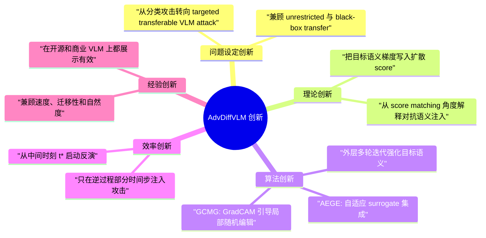

# AdvDiffVLM 创新点分析

## 1. 先给结论

如果把 `AdvDiffVLM` 的创新压缩成一句话，可以概括为：

> 它不是单纯把扩散模型拿来做对抗样本生成，而是把“目标语义梯度”显式写进扩散逆过程的 score 中，再用自适应 surrogate 集成和 GradCAM 引导的空间门控去兼顾迁移性、自然性与效率。

从论文 `2404.10335v4.pdf` 来看，这项工作真正的创新不是“用了 diffusion model”本身，因为：

- unrestricted adversarial example 早就有人用生成模型做过；
- AdvDiffuser 也已经把 diffusion 用到了对抗样本生成；
- 传统 transfer-based attack 也早就有 ensemble、data augmentation、momentum 等增强手段。

`AdvDiffVLM` 的新意主要在于以下 4 件事被组合到了同一套面向 VLM 的 targeted transfer attack 框架里：

1. 把 targeted transferable VLM attack 重写为一个 score-guided diffusion generation 问题。
2. 用 AEGE 把多 surrogate 的目标语义梯度自适应地注入扩散逆过程。
3. 用 GCMG 把 GradCAM 从“直接限制修改区域”改成“引导随机局部编辑”。
4. 通过外层多轮再加噪-再反演，把目标语义持续压进生成结果中。

严格地说，这是一篇 **方法整合型创新较强、单模块原创性中等、系统效果很强** 的工作。

## 2. 论文想解决的核心问题是什么

论文针对的是一个更困难的攻击设定：

- 目标：攻击 Vision-Language Models
- 场景：black-box / gray-box
- 方式：targeted
- 能力要求：transferable
- 输出要求：自然、不受 `l_p` 约束的 unrestricted adversarial examples

作者认为已有方法的主要问题有三类：

1. 传统 transfer-based attack 需要很多迭代，生成很慢。
2. 传统方法引入的是“不自然的噪声语义”，导致迁移性不够。
3. AdvDiffuser 这类 diffusion attack 主要面向分类模型，不足以处理更复杂的 VLM 场景。

因此，论文的创新不是从“是否能攻击”出发，而是从下面这个更苛刻的目标出发：

> 能不能高效地产生自然、定向、可迁移，而且能打到 VLM 甚至商业 VLM 的对抗样本。

## 3. 创新总览



## 4. 创新点一：把 targeted VLM 攻击重写成 score-guided diffusion generation

这是论文最根本的创新点。

### 4.1 以前的方法怎么想

传统 transfer-based attack 的思路基本是：

- 在输入图像上直接优化一个损失；
- 通过很多小步迭代，把图像推向目标语义；
- 为了增强迁移性，再叠加 ensemble、momentum、频域扰动、结构变换等策略。

这一类方法的本质还是“判别式攻击”：

- 优化变量是图像；
- 攻击动力是 surrogate loss；
- 图像自然性主要靠小步长和约束预算硬保住。

### 4.2 AdvDiffVLM 怎么换了问题表述

论文第 IV-A 节的核心动作，是把要生成的对象从“扰动图像”改成了：

> 满足目标语义条件的扩散逆过程分布 `p(x_{t-1} | x_t, c_tar)`。

作者通过 score matching 的视角，把这个条件分布的 score 分解成：

- 原始扩散模型的 score；
- 减去与目标语义相关的梯度项。

最后得到的形式可以理解为：

```text
score = diffusion score + adversarial target semantic gradient
```

这个转换非常关键，因为它意味着：

- 攻击不再只是“在图像上硬推目标损失”；
- 而是“在生成流形上逐步注入目标语义”。

### 4.3 为什么这算创新

因为它改变了攻击的工作空间和工作机制：

- 工作空间：从像素空间转到 latent reverse process；
- 工作机制：从直接梯度优化转成 score-guided generation；
- 语义来源：从人为加噪转成沿扩散先验逐步偏移。

这也是整篇论文最有研究味道的部分。相比“又设计了一个新的损失函数”，这个重写更像是在重新定义攻击范式。

### 4.4 这部分如何落到代码里

当前代码中最接近这部分思想的，是 `ldm/models/diffusion/ddim_main.py` 里的攻击式采样流程：

- 先做标准 DDIM 逆采样；
- 再在逆采样后期对 latent 做目标语义梯度更新；
- 通过 `differentiable_decode_first_stage` 把 latent 映射回可导图像；
- 用 surrogate CLIP 特征对当前图像和目标图像做相似度优化。

代码没有把 `score` 显式写成论文公式里的那个变量，但本质上是在 reverse process 中对生成方向做了目标语义修正。

## 5. 创新点二：AEGE 把多 surrogate 梯度变成“自适应估计的 score 修正项”

这是论文中最核心的算法创新。

### 5.1 传统 ensemble 的问题

普通 ensemble attack 常见做法是：

- 选多个 surrogate；
- 把多个 loss 直接平均或加权求和；
- 用固定权重生成梯度。

问题在于，不同样本对不同 surrogate 的敏感度并不一样：

- 有的 surrogate 在当前样本上更有指导性；
- 有的 surrogate 会给出偏差很大的梯度；
- 固定平均会把这些差异抹平。

### 5.2 AEGE 的新意

AEGE 的核心不是“用了多个 CLIP”，而是：

> 用各 surrogate 最近几个时刻的 loss 变化趋势，动态决定下一步谁更值得信任。

论文的直觉是：

- 如果某个 surrogate 的 loss 变化太快，说明它的估计可能不稳定；
- 如果变化更平滑，则它更接近“可靠的目标语义方向”；
- 因此应该自适应调节不同 surrogate 对 score 修正项的贡献。

这比单纯的 simple ensemble 多了一个“时间维上的可靠性建模”。

### 5.3 为什么这对 VLM 攻击尤其重要

VLM 的目标不是单一分类边界，而是复杂语义响应。

在这种场景下，单一 surrogate 的偏差通常更大。AEGE 的意义就在于：

- 用多 CLIP surrogate 降低单模型偏差；
- 用时序权重更新降低“某个 surrogate 短时异常主导攻击方向”的风险；
- 把 surrogate 集成从“静态平均”升级成“动态估计”。

所以 AEGE 的真正创新点不是 ensemble，而是 **adaptive ensemble in reverse diffusion**。

### 5.4 代码里如何实现

当前实现里，AEGE 主要落在 `ddim_main.py` / `ddim_mask.py`：

- `costs`：记录不同 surrogate 当前步的目标相似度；
- `weights`：根据相邻时刻的 cost 比值更新各 surrogate 权重；
- 最终用这些权重对多个 CLIP 相似度加权求和；
- 再对 latent 求梯度，作为攻击更新。

也就是说，论文中的 AEGE 在代码里被实现成：

> 多个 CLIP image encoder 的相似度损失 + 基于时序 loss 比值的动态权重分配。

## 6. 创新点三：GCMG 对 GradCAM 的用法是“改造性的”，不是照搬

这一点属于论文里比较巧的设计。

### 6.1 直接用 GradCAM mask 的问题

像 AdvDiffuser 这类方法里，GradCAM 往往被拿来直接做掩码：

- 重要区域不动；
- 不重要区域修改。

这种做法对分类任务可能足够，但对 VLM 攻击有两个问题：

1. VLM 的目标语义更复杂，只改非关键区域可能不足以驱动输出改变。
2. 如果所有修改都集中在少数区域，会出现明显的局部异常，视觉质量差。

### 6.2 GCMG 的创新在哪

GCMG 不是把 CAM 直接当二值 mask 用，而是把它变成一个概率引导器：

1. 先对 CAM 截断到一个中间区间；
2. 再归一化成概率图；
3. 每个时间步从概率图里采样一个位置；
4. 只在这个局部窗口放开编辑；
5. 其他区域尽量保持原图在当前噪声时刻的结构。

这背后的想法很重要：

- 不是“只允许某些固定区域被改”；
- 而是“让对抗语义在时序上分散地渗透到图像里”。

这就是论文强调的：

> disperse adversarial semantics throughout the image

### 6.3 为什么这算有效创新

GradCAM 本身当然不是新东西，但这里的新意在于“怎么用它”：

- 传统用法：区域选择器；
- 这里的用法：随机局部编辑的概率引导器。

这种用法带来的收益是：

- 视觉上不容易出现单点爆炸式伪影；
- 对抗语义更像自然编辑而不是噪声堆叠；
- 在 transfer attack 里更容易保住自然性和迁移性之间的平衡。

这属于 **已有工具的新用法**，原创性不如 AEGE 那么强，但非常关键。

### 6.4 代码里如何体现

当前代码的实现流程是：

1. 读取外部预先生成的 `cam`；
2. 对 `cam` 做 clamp；
3. 按概率采样一个坐标；
4. 在该位置附近挖一个局部窗口；
5. 通过
   `img = img_orig * mask + (1 - mask) * img`
   把源图 noisy latent 和当前 adversarial latent 融合。

从实现效果上看，代码确实在做论文说的“局部时序编辑”。

## 7. 创新点四：用外层多轮迭代把目标语义逐轮压进结果

这一点在论文里不如 AEGE/GCMG 那么显眼，但实际上很关键。

### 7.1 论文层面的含义

论文在算法最后明确提出：

- 把生成出的对抗样本重新作为 `x0`
- 再进行下一轮扩散-反演
- 通过 `N` 轮迭代持续强化目标语义

这其实是在解决一个现实问题：

- 单次 reverse process 虽然可以注入目标语义；
- 但目标语义可能还不够强、不够稳定；
- 反复迭代能逐步提高 transferability。

### 7.2 为什么这算创新

严格来说，这不是理论创新，而是 **很有效的系统设计创新**。

它把攻击过程从“一次采样”改成了“反复编辑”：

- 每轮都在已有结果上继续注入目标语义；
- 同时又通过重新加噪保留一定生成弹性；
- 因而得到更强、更自然的目标迁移效果。

### 7.3 代码如何体现

当前 `main.py` 里，第一次采样之后会把 `samples_ddim` 重新作为下一轮输入，再重复 9 次，总计 10 轮。这正对应论文里的外层迭代 `N=10`。

这一点说明论文和代码在这个设计上是高度一致的。

## 8. 创新点五：效率创新不只是“跑得快”，而是攻击路径本身更短

论文强调自己比 SOTA 快 `5x - 10x`，这不是单纯靠工程优化实现的，而是路径设计本身更短。

### 8.1 为什么传统方法慢

传统 transfer attack 慢，主要因为：

- 在像素空间做很多次小步迭代；
- 经常还带内部循环、数据增强、频域变换或结构变换；
- 每一步都要跑多个 surrogate。

### 8.2 AdvDiffVLM 为什么快

它快有 4 个原因：

1. 攻击发生在 latent 空间，不在高分辨率像素空间。
2. 不是从纯高斯噪声完整采样，而是从中间时刻 `t*` 开始反演。
3. 只在 reverse process 的一段时间步中施加攻击更新。
4. 外层虽然有多轮，但单轮内部不需要像 PGD 那样执行大量显式迭代。

换句话说，它不是简单把同样的流程写快了，而是：

> 把“应该在哪个空间、哪个时刻、用哪种更新方式做攻击”重新设计了一遍。

这属于 **算法级效率创新**，不是纯工程调优。

## 9. 创新点六：把 unrestricted attack 从分类模型推进到 VLM 场景

这一点容易被低估。

### 9.1 为什么从分类到 VLM 不是平移

分类攻击里，一个图像通常只对应一个 label。

但在 VLM 里：

- 一个图像可能对应很多合理描述；
- 目标语义不再是单一类别，而是更复杂的文本或跨模态语义；
- 即使攻击没有完全失败，模型也可能输出另一个不相关但仍然合理的描述。

所以：

> 针对 VLM 的 targeted attack，目标更宽、容错更高、语义空间更复杂。

### 9.2 论文的创新点

论文不是把 AdvDiffuser 机械搬到 VLM 上，而是专门围绕 VLM 的语义复杂性做了三件事：

1. 用 CLIP 建模跨模态目标语义；
2. 用 ensemble 提升迁移性；
3. 用 unrestricted generation 保证自然语义而不是硬噪声。

这使得它相比传统 classification attack，更像一个“跨模态语义生成攻击框架”。

## 10. 相比已有工作的具体创新边界

这部分最适合回答“创新到底强不强”。

### 10.1 相比 AttackVLM

相对 `AttackVLM`，创新在于：

- 从 query-based / query-assisted 转为纯 transfer-based unrestricted generation；
- 不再依赖大量黑盒查询；
- 用 diffusion reverse process 直接生成带目标语义的样本；
- 在效率和跨模型适用性上更强。

所以它对 `AttackVLM` 的核心增量是：

> 从“黑盒估计梯度”切到“生成式注入目标语义”。

### 10.2 相比传统 transfer-based attacks

相对 `SSA / SIA / CWA / SVRE / Ens`，创新在于：

- 不再只做像素扰动；
- 不再只用判别式 loss 直接推动样本；
- 引入 diffusion 先验，生成更自然的目标语义；
- 引入 score matching 解释；
- 引入 adaptive ensemble 和 mask-based semantic dispersal。

所以这里的创新是 **攻击范式升级**。

### 10.3 相比 AdvDiffuser

这是最关键的对比。

相对 `AdvDiffuser`，论文宣称的核心创新有 3 个：

1. 任务更难：从分类模型升级到 VLM。
2. 理论不同：不是 PGD 加到 latent 上，而是通过 score matching 注入目标语义。
3. mask 用法不同：不是直接限制区域，而是引导分散式编辑。

如果说 `AdvDiffuser` 是：

> diffusion + PGD

那么 `AdvDiffVLM` 更接近：

> diffusion + score-guided target semantics + adaptive surrogate ensemble + GradCAM-guided semantic dispersal

这就是它相对 `AdvDiffuser` 的核心创新边界。

## 11. 哪些创新最“硬”，哪些更偏工程

为了避免把所有点都吹成同等强度，最好把创新强度分层。

### 11.1 最硬的创新

这两点最有研究价值：

1. 把 targeted VLM attack 表述为 score-guided diffusion generation。
2. 在 reverse diffusion 中引入 AEGE，自适应估计多 surrogate 的目标语义梯度。

这两点决定了方法的核心理论框架。

### 11.2 中等强度的创新

这两点更偏方法设计：

1. GCMG 对 GradCAM 的改造性用法。
2. 外层多轮迭代强化目标语义。

它们不是完全新理论，但对最终效果非常重要。

### 11.3 更偏系统/实验创新

这些更像系统层贡献：

1. 在多种开源 VLM 和商业 VLM 上展示有效。
2. 在速度、图像质量、迁移性三项之间做到了较好折中。
3. 给出了较完整的 ablation 和 defense resistance 结果。

## 12. 当前代码如何支撑这些创新

结合当前仓库，论文创新点和代码映射关系大致如下。

| 论文创新 | 代码落点 | 当前实现状态 |
| --- | --- | --- |
| score-guided diffusion attack | `ldm/models/diffusion/ddim_main.py` | 已实现核心思想 |
| AEGE | `costs`、`weights`、多 CLIP 相似度加权 | 已实现，但与论文公式有细节偏差 |
| GCMG | `cam -> prob_matrix -> sample_coordinates -> mask fusion` | 已实现核心流程 |
| 外层多轮 N | `main.py` 外层重复采样 | 已实现且与论文一致 |
| 类条件扩散先验 | `configs/latent-diffusion/cin256-v2.yaml` + `ClassEmbedder` | 已实现 |
| 目标语义来自 target image | `main.py` 中 `tgt_image_features_list` | 已实现 |

从这个角度看，代码确实把论文的主要创新点都覆盖到了，不是只实现了一个粗略 demo。

## 13. 但代码和论文之间有几个重要偏差

这部分很值得单独指出，因为它影响你如何评价“创新是否被忠实实现”。

### 13.1 AEGE 权重公式和代码实现不完全一致

论文 Eq.8 的形式是：

```text
w_i(t) = sum_j exp(...) / (N_m * exp(...))
```

它的语义是：

- 某个 surrogate 的变化越快，分母越大，权重应越小。

但当前代码里采用的是：

```python
weights[i, m] = sum_w / N_models * exp(w_m / Temp)
```

这在符号方向上和论文公式并不一致。也就是说：

- 论文表达的是“变化快 -> 降权”；
- 代码更像是“变化快 -> 升权”。

这不代表代码一定错，但至少说明：

> 论文里的 AEGE 理论和仓库中的 AEGE 实现之间存在明显不一致。

### 13.2 论文说“修改 score”，代码更像“DDIM 后追加 latent 更新”

论文方法描述里，目标语义梯度是并入 score 再参与采样的。

但代码实际流程更接近：

1. 先做标准 DDIM 单步；
2. 再对当前 latent 做一次额外梯度更新。

因此，代码是论文思想的一个近似实现，而不是严格逐项照公式复现。

### 13.3 GCMG 的论文描述和代码细节也有轻微偏差

论文文字描述里，对采样区域的 mask 表述较像“把该区域设为 1”。

而代码中是：

- 先复制 `cam`；
- 再把被采样的小块设为 `0`；
- 然后让这块走 adversarial latent，其余区域尽量贴回原图 noisy latent。

所以论文和代码在 mask 细节表述上不是完全一字对齐，但整体思想是一致的：

- 局部放开编辑；
- 其他区域更保守。

### 13.4 当前仓库不是论文复现实验包级别的干净状态

这不是创新本身的问题，但会影响复现感受：

- `demo.py` 还有 merge conflict；
- `main.py` 里保留了大量空路径、绝对路径和本地脚本痕迹；
- 有些参数接口保留了但没有真正用上。

所以：

> 论文创新是完整的，但当前仓库更像“作者实验代码公开版”，不是彻底工程化的复现实验包。

## 14. 对创新性的最终评价

如果站在论文评审或代码审阅的角度，我会这样评价这篇工作的创新性。

### 14.1 它最有价值的地方

最有价值的不是某个单独模块，而是：

- 重新定义了 VLM targeted transfer attack 的生成式实现路径；
- 把 diffusion prior、score matching、adaptive ensemble、GradCAM mask 组织成了一套闭环；
- 并且在速度、自然性和迁移性之间拿到了有说服力的结果。

### 14.2 它不是那种“纯理论突破型”论文

它的很多模块都能找到前置思想来源：

- diffusion 不是新的；
- score matching 不是新的；
- ensemble 不是新的；
- GradCAM 不是新的；
- 多轮迭代也不是新的。

真正的创新在于：

> 如何把这些已有思想在 VLM unrestricted targeted transfer attack 这个具体问题上重新组织，并让它们彼此协同。

所以它更像一篇：

- 理论上有一条主线；
- 算法上有两个关键模块；
- 系统上做了有效整合；
- 实验上给出强支撑。

### 14.3 综合判断

综合来看，`AdvDiffVLM` 的创新性可以概括为：

- **核心框架创新：强**
- **单模块原始性：中等偏上**
- **工程整合与系统效果：强**
- **相对已有 unrestricted attack 的增量：明确且成立**

## 15. 一句话总结

`AdvDiffVLM` 真正的新意，不是“用 diffusion 生成对抗样本”，而是：

> 用 score matching 把目标语义注入扩散逆过程，用 AEGE 提高目标梯度估计的可靠性，用 GCMG 控制语义在空间上的分散式渗透，再通过多轮反演把这些语义稳定压进最终图像，从而把 unrestricted targeted transfer attack 推进到了 VLM 场景。
